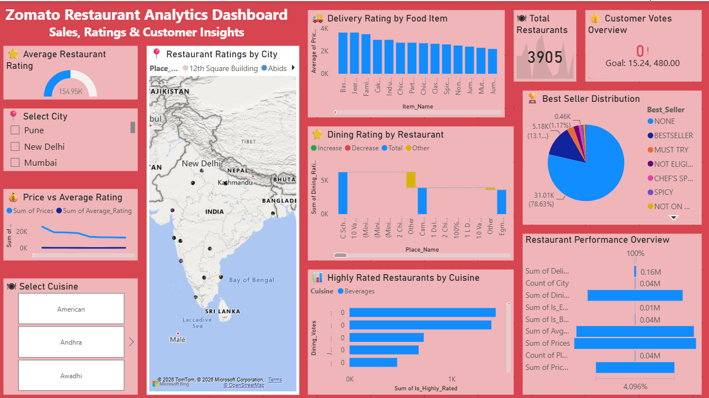

# 🍽️ Zomato Restaurant Analytics Dashboard

## 📌 Project Overview

This project analyzes Zomato restaurant data using Microsoft Power BI. The dashboard provides insights into restaurant ratings, cuisines, customer votes, pricing, delivery performance, and restaurant trends.

## 🛠️ Tools Used

- Power BI
- Microsoft Excel
- Data Visualization

## 📊 Dashboard Features

- Restaurant Ratings
- Customer Votes
- Cuisine Analysis
- Delivery Rating Analysis
- Restaurant Performance
- Interactive Filters
- Maps
- Charts & KPIs

## 📂 Files Included

- Zomato_Restaurant_Analytics_Dashboard.pbix
- Zomato_Dataset.xlsx
- Dashboard_Screenshot.png

## 📈 Key Insights

- Identified the highest-rated restaurants.
- Compared restaurant performance across different cities.
- Analyzed customer ratings and voting patterns.
- Examined cuisine popularity.
- Compared pricing with customer ratings.
- Visualized delivery performance using interactive charts.

## 💡 Skills Demonstrated

- Data Cleaning
- Data Visualization
- Dashboard Design
- KPI Development
- SQL Analysis
- Power BI
- Microsoft Excel

  
## 📷 Dashboard Preview

## 👩‍💻 Author

**Santoshi Pandalwad**

Aspiring Data Analyst

GitHub: https://github.com/pandalwadsantoshi3-hub

